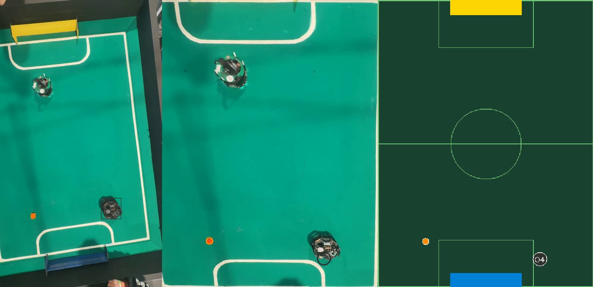
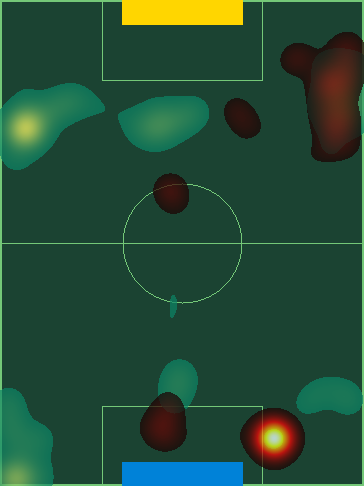
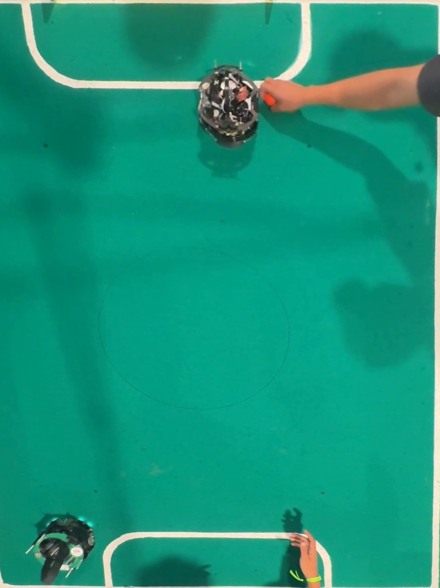
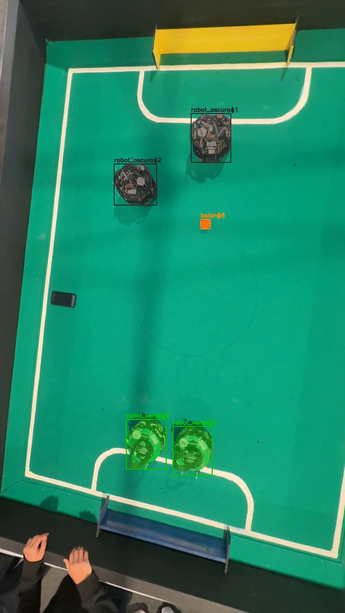
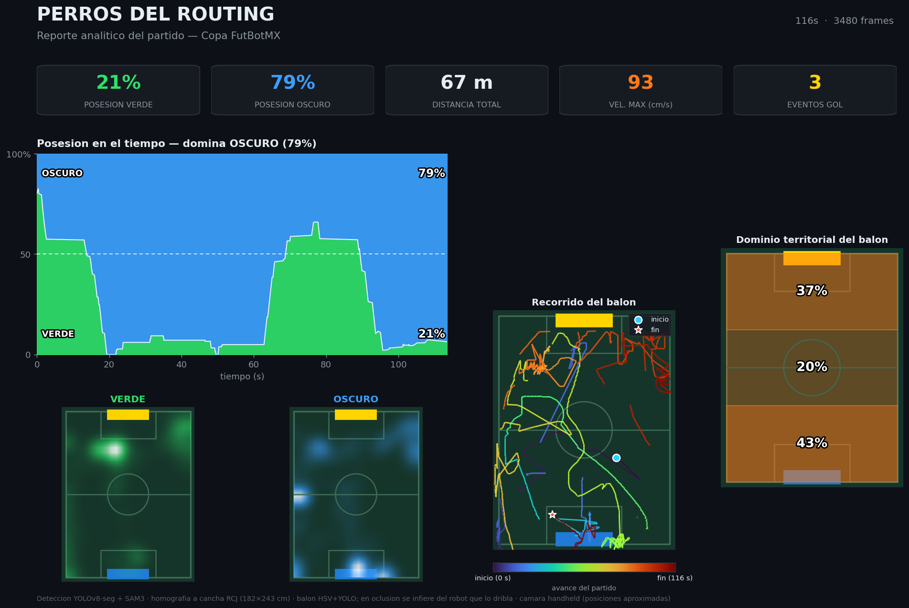

# FutBotMX — Análisis de Fútbol Robótico con SAM 3

Solución para la **Copa FutBotMX, Capítulo Visión por Computadora** (Secihti + Meta),
categoría **Amateur**. Pipeline que usa **SAM 3 (Segment Anything Model 3, Meta)** para
segmentar, rastrear y analizar partidos de fútbol robótico (RoboCupJunior Soccer) desde
video cenital, generando un **mapa táctico**, **mapa de calor de control**, **posesión por
equipo** y **detección de gol**.

**Equipo: Perros del Routing**

| Integrantes |
|---|
| Peñarrieta Villa Jesús |
| Reyes Cuevas Abraham |
| Ullola Castro Jade |
| Vega Miranda Daniel |

**Reel de Instagram:** _<agregar link>_

---

## Enfoque

Los robots de la cancha son **negros con placa (PCB) visible**: un equipo expone **PCB verde**
y el otro es **oscuro**. El truco clásico de color azul/rojo no aplica, así que el sistema
combina varias técnicas:

1. **Auto-etiquetado con SAM 3** — SAM 3 con prompts de texto (`"robot"`, `"small robot"`)
   segmenta los robots en cada frame sin detector previo. Se clasifica el equipo por el
   *hue mediano* dentro de la máscara (verde-PCB vs oscuro) y el balón por color (HSV naranja).
   Esto produce un dataset de segmentación sin etiquetar a mano.
2. **Detector fino YOLOv8-seg** — entrenado sobre el dataset (revisado en Roboflow). Rápido,
   detecta y clasifica equipos en tiempo casi real.
3. **Refinamiento con SAM 3** — en el pipeline de análisis, las cajas del detector sirven de
   prompt a **SAM 3** para obtener máscaras precisas (modo `--sam`).
4. **Homografía** (`cv2.getPerspectiveTransform` / `warpPerspective`) — proyecta la cancha
   oblicua a una **vista cenital canónica** (RCJ Soccer Field, 182×243 cm) para medir
   posiciones reales, dibujar el mapa táctico y acumular el mapa de calor.

## Arquitectura

```
                 ┌─────── dataset_generation ───────┐
  Video 9933 ──► │ SAM 3 (texto) → máscaras         │ ──► dataset YOLOv8-seg ──► Roboflow (QA)
  (cenital)      │ + clasificación equipo (HSV)     │
                 └──────────────────────────────────┘
                 ┌──────────── training ────────────┐
  dataset QA ──► │ YOLOv8-seg fine-tuning           │ ──► best.pt (robot_verde/oscuro/balon)
                 └──────────────────────────────────┘
                 ┌──────────── analysis ────────────┐
  Video 9938 ──► │ YOLOv8-seg → SAM 3 (refina) →    │ ──► video 3 paneles + heatmap +
  (cenital)      │ ByteTrack → homografía           │     posesión + goles
                 └──────────────────────────────────┘
```

Salida del análisis (3 paneles): **cámara + máscaras | vista cenital real (warp) | mapa táctico**.

## Resultados

| | |
|---|---|
|  |  |
| Análisis: cámara · cenital real · táctico | Mapa de calor de control por equipo |
|  |  |
| Vista cenital real (`warpPerspective`) | Auto-etiquetado SAM 3 + equipos |

- **Detector** (YOLOv8-seg, validación contra labels corregidos en Roboflow):
  box mAP@50 **0.91**, máscara mAP@50 **0.83**.
- **Análisis**: posesión por equipo, mapa de calor de zonas controladas, detección de gol
  (balón dentro de la zona de portería en el campo canónico).

## Analítica avanzada

El pipeline registra las **posiciones cenitales por-frame** (`tracks.csv`) y `visualize.py`
las convierte en un **reporte de partido estilo broadcast** sobre el campo canónico a escala
real (cm). El diseño sigue principios de *The Art of Insight* (Cairo): cada gráfico titula la
**conclusión**, el color codifica identidad de equipo, etiquetado directo y mínimo *chart-junk*.



- **KPIs** — posesión por equipo, distancia total, velocidad máxima, eventos de gol.
- **Momentum de posesión** — vaivén equipo a equipo (ventana móvil del robot más cercano al balón).
- **Recorrido del balón** — estela con color por progresión temporal.
- **Mapas de calor por equipo** — densidad de ocupación suavizada sobre la cancha.
- **Dominio territorial** — % de tiempo del balón por tercio.
- **Físico** — distancia recorrida y distribución de velocidad por equipo.

Funciona sobre cualquier video con su calibración:

```bash
python analysis/run_analysis.py --video ruta/al/video.mp4 \
    --calib ruta/field_calib.json --start 120 --end 3600 --name partido
python analysis/visualize.py --name partido
```

## Requisitos

- **Hardware**: GPU NVIDIA recomendada (probado en RTX 4060, 8 GB). SAM 3 requiere ~8 GB de RAM
  libre para cargar. En CPU funciona pero SAM 3 es muy lento (~30–60 s/frame).
- **Software**: Python 3.11, CUDA 12.x. Ver `requirements.txt`.
- **Modelo SAM 3**: `sam3.pt` (~3.4 GB) con acceso aprobado en
  [huggingface.co/facebook/sam3](https://huggingface.co/facebook/sam3), colocado en `sam3.pt`.

## Instalación

```bash
conda create -n futbot python=3.11 && conda activate futbot
pip install torch torchvision --index-url https://download.pytorch.org/whl/cu124
pip install -r requirements.txt
# Descargar sam3.pt (acceso HF) -> sam3.pt
```

## Uso (reproducción)

```bash
# 1. Calibrar campo + porterías (una vez por cámara; clic 4 esquinas)
python dataset_generation/field_calib.py --video ds --click   # dataset (9933)
python dataset_generation/field_calib.py --video an --click    # análisis (9938)

# 2. Generar dataset auto-etiquetado con SAM 3
python dataset_generation/autolabel.py --discover sam --video ds
python dataset_generation/autolabel.py --discover sam --video an
python dataset_generation/export_roboflow.py        # -> YOLOv8-seg para Roboflow

# 3. (QA en Roboflow) y entrenar el detector
python training/train_baseline.py --model yolov8s-seg.pt \
    --data ROVOT-VISION.yolov8/data_local.yaml --name qa_s

# 4. Análisis del partido (genera video + heatmap + stats)
python analysis/run_analysis.py --start 12600 --end 13800 --name demo
python analysis/run_analysis.py --start 5200 --end 5400 --sam --name demo_sam  # con SAM 3
```

Salidas en `analysis/output/<name>/`: `analisis.mp4`, `heatmap.png`, `stats.json`,
`tracks.csv` (posiciones por-frame).

```bash
# 5. Gráficos analíticos a partir de tracks.csv (-> output/<name>/viz/)
python analysis/visualize.py --name demo
```

Genera `match_report.png` (panel maestro estilo broadcast) + PNGs sueltos (momentum de posesión,
heatmaps, trayectoria del balón, físico, territorio).

## Estructura

```
sam3.pt                       # modelo SAM 3 (no versionado, se descarga aparte)
dataset_generation/           # auto-etiquetado SAM 3 -> dataset YOLOv8-seg
training/                     # fine-tuning YOLOv8-seg + tests
analysis/                     # pipeline de análisis (homografía, táctico, heatmap, gol)
docs/                         # capturas para este README
```

Cada subcarpeta tiene su propio `README.md` con detalle de objetivo, entradas y salidas.

## Tecnologías y créditos

- **SAM 3 — Segment Anything Model 3** (Meta AI) · [repo](https://github.com/facebookresearch/sam3) ·
  bajo *SAM License* (ver términos del modelo).
- **Ultralytics YOLOv8** (detección/segmentación) · **Supervision** (Roboflow) · **ByteTrack** ·
  **OpenCV**.
- Videos de partidos: Federación Mexicana de Robótica / Torneo Mexicano de Robótica (Copa FutBotMX).
- Curso base de visión (Supervision/SAM 3/homografía) provisto por la organización.

Asistentes de IA usados como apoyo de desarrollo (permitido por la convocatoria, sec. 3.1.3).

## Licencia

Código bajo licencia **MIT** (ver [LICENSE](LICENSE)). El modelo SAM 3 se rige por su propia
licencia; los participantes deben cumplir sus términos.
